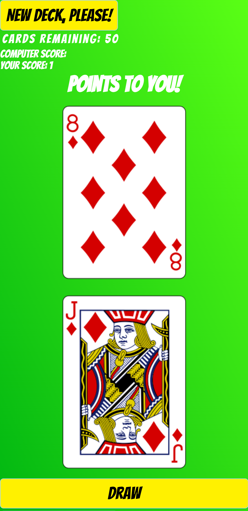

# Killy's Game of War

> This is an An Api based game with cards from https://www.deckofcardsapi.com. The objective of the game is to win all of the cards. The deck is divided evenly among the players, giving each a down stack. In unison, each player reveals the top card of their deck—this is a "battle"—and the player with the higher card takes both of the cards played and moves them to their stack.

## Live Demo

[Live Demo Link](https://killy10o10.github.io/game-of-war/)

## Built With

- HTML
- CSS
- javascript

## Author

👤 **Okine Kingsley**

- GitHub: [@killy10o10](https://github.com/killy10o10)
- Twitter: [@Quami_Killy](https://twitter.com/Quami_Killy)
- Instagram: [quami_killy](https://www.instagram.com/quami_killy/)

## 🤝 Contributing

Contributions, issues, and feature requests are welcome!

## Show your support

Give a ⭐️ if you like this project!

## Acknowledgments

- Hat tip to anyone who's code/resource was used
